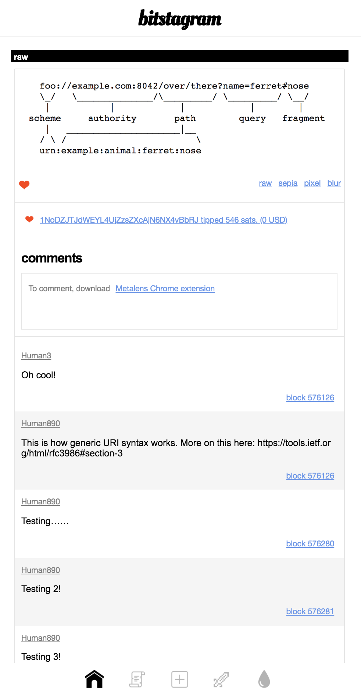

# Bitcoin Sticker Protocol

> Attach Bitcoin metadata to offchain resources

Homepage: [sticker.planaria.network](https://sticker.planaria.network)


The Bitcoin sticker protocol lets you associate non-Bitcoin resources with Bitcoin. You can use the protocol to declare ownership or affiliation of non-Bitcoin resources, objects, services, agents that exist outside of the Bitcoin universe.

The best part: **You can trivially implement this for your existing website or api, TODAY.**

# Attributes

For version 0.0.1, we start only with the basic attributes (This may be extended in the future):

1. **Bitcoin transaction id:** `bitcoin-tx`
2. **Bitcoin address:** `bitcoin-address`

# Methods

The protocol can be implemented in two different ways:

1. **HTML Inline Metadata:** Declare as an HTML meta tag.
2. **HTTP Response Header:** Declare as an HTTP response header attribute.

## 1. HTML Inline Metadata

Using an HTML `<meta>` tag, you can attach unique Bitcoin metadata (Transaction id or an address) to any HTML document, inline.

```
<html>
<head>
  <meta name="bitcoin-tx" content="fd7958fd42b0f5c837b427b1d2631c5f4ec754556c3a3197640efea5bc4678cc">
  ...
</head>
...
</html>
```

```
<html>
<head>
  <meta name="bitcoin-address" content="19HxigV4QyBv3tHpQVcUEQyq1pzZVdoAut">
  ...
</head>
...
</html>
```

With the meta tag, a browser or an agent can easily infer that the current page is associated with a Bitcoin resource (a transaction or an address) and act accordingly.

## 2. HTTP Response Header

Using an HTTP response header, you can attach unique Bitcoin metadata (a transaction id or an address) to any resource behind an HTTP endpoint.

> Pay attention to the last lines of the headers

```
HTTP/1.1 200 OK
server: nginx/1.15.5 (Ubuntu)
date: Sun, 31 Mar 2019 19:21:05 GMT'
content-type: image/jpeg
content-length: 90887
connection: close
x-powered-by: Express
access-control-allow-origin: *
bitcoin-address: 1KuUr2pSJDao97XM8Jsq8zwLS6W1WtFfLg
```

```
HTTP/1.1 200 OK
server: nginx/1.15.5 (Ubuntu)
date: Sun, 31 Mar 2019 19:21:05 GMT'
content-type: image/jpeg
content-length: 90887
connection: close
x-powered-by: Express
access-control-allow-origin: *
bitcoin-tx: 55849b6523632bbaf98e746c8a8218b918badc5dd82ddefe47f2785c744c3f5e
```

This method is useful for HTTP endpoints which return responses in JSON or XML, or an HTTP file server that returns a binary blob as response.

We can't use the <meta> tag approach for these cases because these are not HTML documents. For these we use the HTTP response header.

We simply introduce new HTTP response header attributes such as `bitcoin-tx` and `bitcoin-address`.

# Why?

## 1. Magnetize Everything with Bitcoin

One important benefit of uploading things to Bitcoin is that you effectively turn them into traceable, monetizable, and interoperable objects that live forever on the blockchain with forever immutable references.

However, not everything can be easily turned into a transaction, and not everything needs to be turned into a transaction today. This includes legacy HTTP-based web pages, open data, dynamic API endpoints, ephemeral resources, etc.

For these objects we need a way to "magnetize" them with Bitcoin world somehow WITHOUT turning them into a Bitcoin transaction.

## 2. Associate Bitcoin Identity to non-Bitcoin endpoints.

Many times you may want to attach a Bitcoin address identity to your APIs so people can pay for usage somehow. The existing solutions are primitive and not processible by machines, therefore requiring manual payment.

By using a standard header format, we not only can make this easy for humans but also for machines to automatically make payments to ANY offchain resources, automatically and programmatically.


# Example

## Metalens + Bitstagram

[Metalens](https://chrome.google.com/webstore/detail/metalens-extension/odoinflckdonpofihlicjjknlgnhhaem) is a Chrome extension that lets you comment on any web page online, where each comment is stored as a Bitcoin transaction. All the messages are stored on the blockchain.

One interesting thing about the Metalens protocol is that you can comment on ANY resource, not just HTTP URIs. This includes Bitcoin transaction ids.

To take advantage of this feature, [Bitstagram](https://bitstagram.bitdb.network) is using the Sticker Protocol to describe its peramlink pages with the `<meta>` tag. Then, Metalens automatically parses the meta tag to understand that this page is about a Bitcoin transaction, and lets you comment on each post as unique transaction ID (Instead of HTTP URL). 


Here's an example: https://bitstagram.bitdb.network/beta/m/raw/5980a43d3b7e07fac4207e4b9cb484ee2b07f50ecf759d878473770ea01ff06f 

